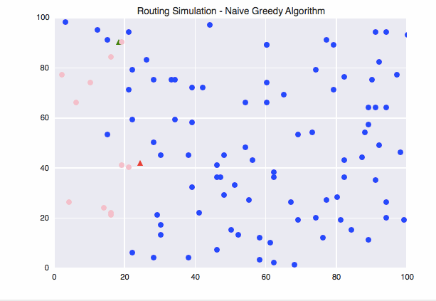

Multiple Vehicle Routing simulation based off a naive greedy algorithm.

Red/Green Triangles: Vehicles

Blue circles: Targets that have not yet been reached

Pink circles: Targets that have already been reached

Below simulation is for the route_simulation.py file.

